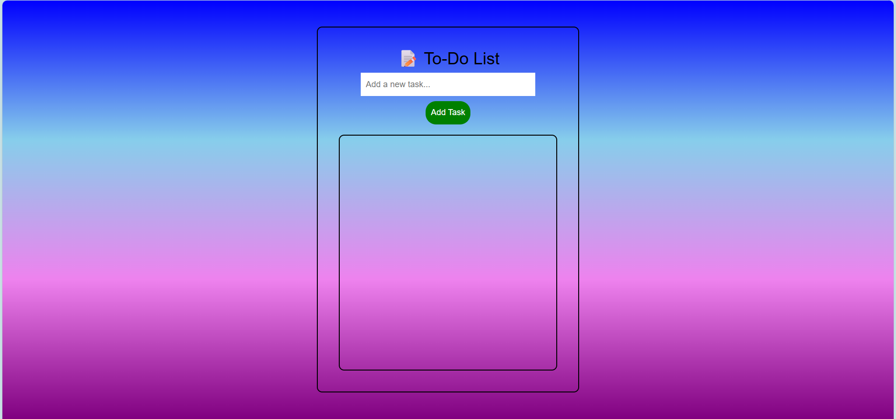
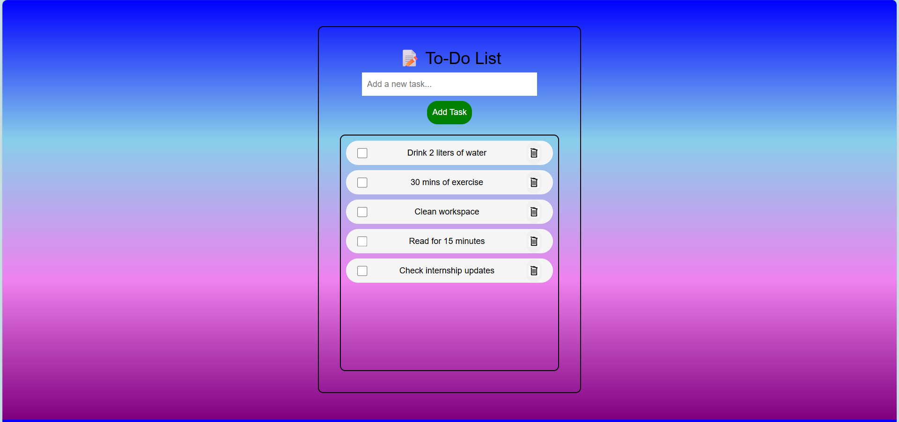
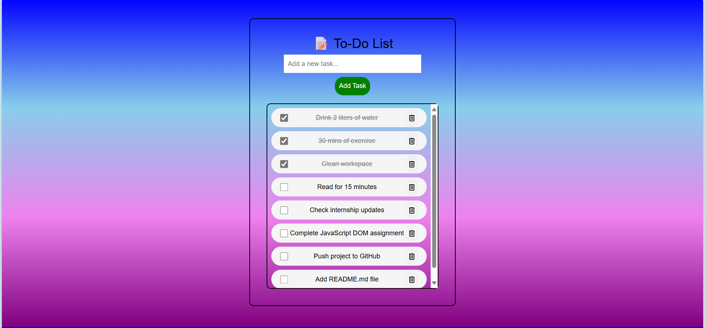

# 📝 To-Do List Web App

This is a simple and responsive **To-Do List** web application built using **HTML**, **CSS**, and **JavaScript** as part of my **SkillCraft Internship**. The app helps users keep track of their daily tasks with the ability to add, check off, and delete tasks. Tasks are saved in the browser using `localStorage`.

## 🔗 Live Demo

[Click here to try it out 🚀] (https://codingwithpavani.github.io/SCT_WD_4/) 

---

## 📌 Features

- ✅ Add new tasks
- ✅ Mark tasks as completed
- ✅ Delete tasks
- ✅ Task data is saved in **localStorage**
- ✅ Responsive design using Bootstrap
- ✅ Scrollable task list while header stays fixed

---

## 💻 Tech Stack

- HTML5  
- CSS3 (with custom styling and gradients)  
- JavaScript (DOM, localStorage)  
- Bootstrap 5  

---

## 📷 Screenshots





---

## 🚀 Getting Started

1. Clone the repository:

   ```bash
   git clone https://github.com/codingWithPavani/SCT_WD_4

2. Open index.html in your browser.

3. Start adding your tasks!  

```
📁 Project Structure
📦 To-Do List/
 ┣ 📄 index.html
 ┣ 📄 style.css
 ┣ 📄 script.js
 ┣ 📁 screenshots/
 ┃  screenshot_1.png
 ┃  screenshot_2.png    
    screenshot_3.png
```
---

## 🤝 Contribution
Contributions are welcome! Feel free to fork this project and improve it.

---


## 🙋‍♀️ Author
Pavani Abothula
🔗 www.linkedin.com/in/pavani-abothula
💼 SkillCraft Internship Project

---

## 📃 License
This project is open-source and free to use for educational purposes.

